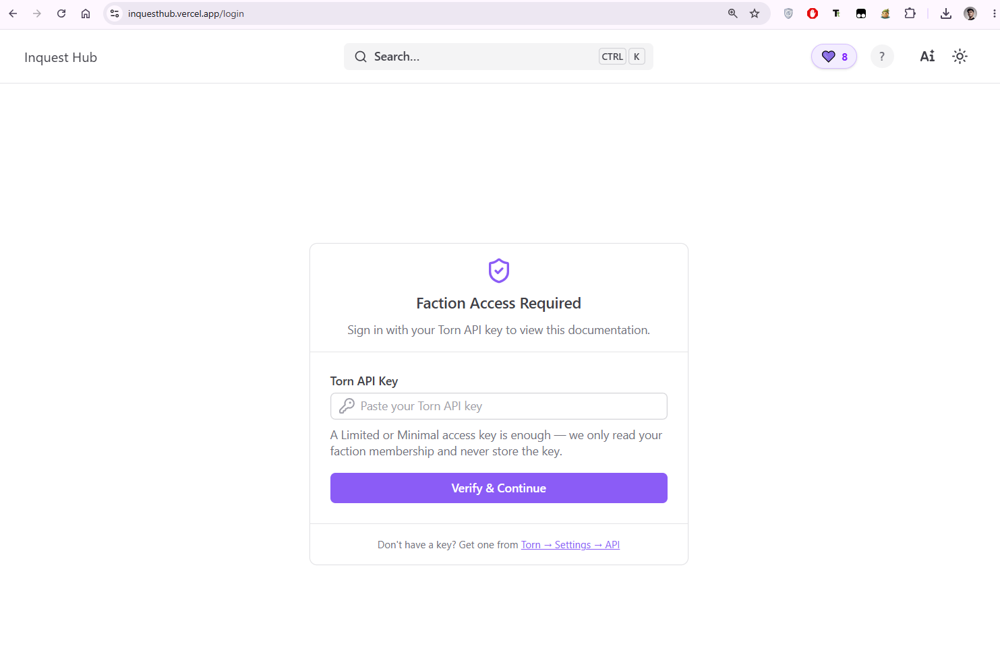
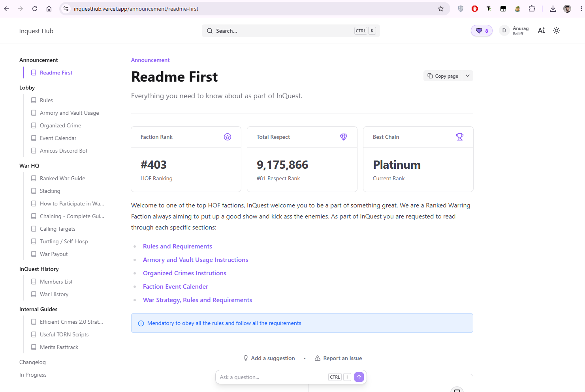
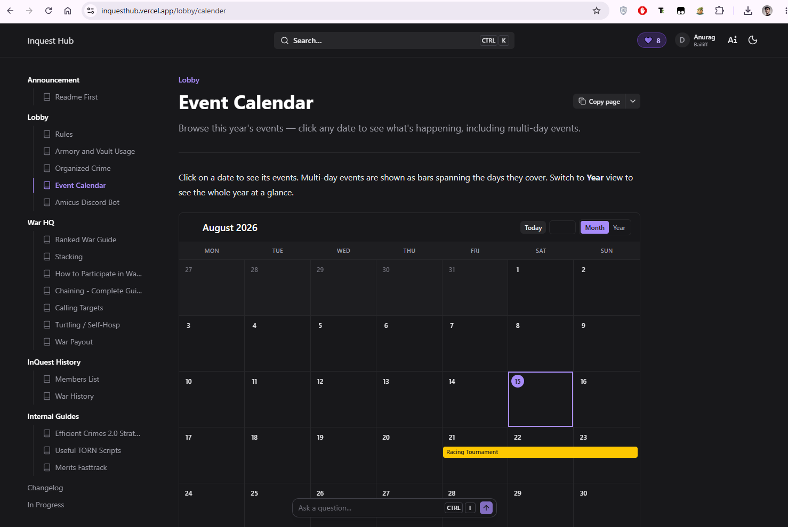

# Documentation Platform

A modern, full-stack documentation web application built with **Nuxt**, **Docus**, **Vue**, **Supabase**, and **Vercel**.

The platform is designed to provide a fast, structured, and maintainable documentation experience with a clean UI, dynamic content, and a serverless backend for interactive features.

## API only access


## Nuxt Documentation


## Custom Vue Components


## ✨ Features

- 📚 **Structured Documentation** — Organize content into sections, pages, and navigation hierarchies.
- ⚡ **Nuxt-powered** — Fast, modern Vue-based application with SSR and static optimization.
- 🎨 **Docus UI** — Documentation-focused layout, navigation, search, and content presentation.
- 🧩 **Vue Components** — Reusable interactive components throughout the documentation.
- 🗄️ **Supabase Backend** — Database and backend services for application data and interactive features.
- 🔐 **Row Level Security** — Database access protected through Supabase RLS policies.
- 🚀 **Vercel Deployment** — Serverless deployment and hosting with automatic builds.
- 📱 **Responsive Design** — Optimized for desktop and mobile documentation workflows.
- 👍 **User Reactions** — Documentation pages can support user feedback and reactions.
- 📝 **Markdown / MDX Content** — Documentation can be written using a developer-friendly content workflow.

## 🛠️ Tech Stack

| Technology | Purpose |
|---|---|
| **Nuxt** | Application framework |
| **Vue** | UI framework |
| **Docus** | Documentation framework and UI |
| **Nuxt UI** | UI components and styling |
| **Supabase** | Database and backend services |
| **Vercel** | Deployment and hosting |
| **TypeScript** | Type-safe development |
| **Markdown / MDX** | Documentation content |

## 🏗️ Architecture

```text
                    ┌─────────────────────┐
                    │       Vercel        │
                    │   Hosting / CDN     │
                    └──────────┬──────────┘
                               │
                               ▼
                    ┌─────────────────────┐
                    │        Nuxt         │
                    │ Application Layer   │
                    └──────────┬──────────┘
                               │
                 ┌─────────────┴─────────────┐
                 ▼                           ▼
        ┌─────────────────┐         ┌─────────────────┐
        │      Docus      │         │      Vue        │
        │ Documentation   │         │ Interactive UI  │
        └─────────────────┘         └────────┬────────┘
                                             │
                                             ▼
                                   ┌─────────────────┐
                                   │     Supabase    │
                                   │ Database / RLS   │
                                   └─────────────────┘
```

The documentation content is primarily handled through the Nuxt/Docus content layer, while Supabase provides persistent application data for features that require a backend.

## 🚀 Getting Started

### Prerequisites

- Node.js
- npm, pnpm, or another compatible package manager
- A Supabase project for backend functionality

### Installation

Clone the repository:

```bash
git clone <repository-url>
cd <repository-name>
```

Install dependencies:

```bash
npm install
```

Create your environment file:

```bash
cp .env.example .env
```

Configure the required Supabase environment variables in `.env`.

Start the development server:

```bash
npm run dev
```

The application will be available at:

```text
http://localhost:3000
```

## 📦 Build

Create a production build:

```bash
npm run build
```

Preview the production build locally:

```bash
npm run preview
```

## 🌐 Deployment

The application is designed to be deployed on **Vercel**.

A typical deployment workflow is:

```text
Git Push
   ↓
Vercel Build
   ↓
Nuxt Production Build
   ↓
Deployment
```

Environment variables required by Supabase should be configured through the Vercel project settings.

## 📁 Project Structure

```text
.
├── assets/          # Styles and static assets
├── components/      # Reusable Vue components
├── content/         # Documentation content
├── layouts/         # Application layouts
├── pages/           # Application routes
├── public/          # Public static files
├── server/          # Server-side functionality
├── app.config.*     # Application configuration
├── nuxt.config.*    # Nuxt configuration
└── package.json     # Project dependencies and scripts
```

The exact structure may evolve as the application grows.

## 🔐 Backend & Security

> Supabase is used for persistent application data and interactive functionality.

Database access is protected using **Row Level Security (RLS)** policies. Public-facing operations are intentionally limited to the permissions required by the application.

Built with **Nuxt · Vue · Docus · Supabase · Vercel**